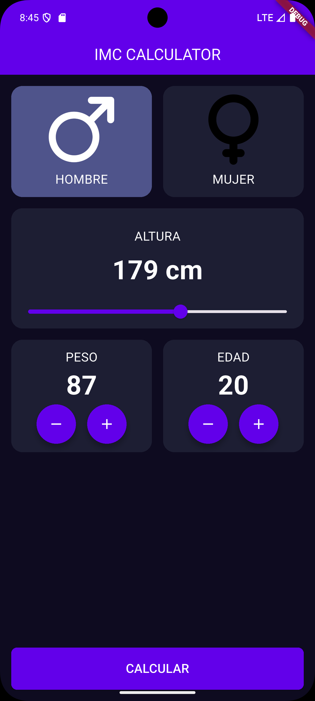

# Calculator App (IMC) — Flutter

Esta es una aplicación sencilla desarrollada en Flutter que permite calcular el Índice de Masa Corporal (IMC) ingresando peso y altura.
El objetivo del proyecto es practicar manejo de inputs, validaciones simples, lógica básica y construcción de UI.

# Características

Ingreso de peso (kg) y altura (cm).

Cálculo automático del IMC.

Clasificación del resultado según la OMS:

Bajo peso

Normal

Sobrepeso

Obesidad

UI simple con diseño limpio.

Manejo de errores básicos (campos vacíos o valores inválidos).

# Funcionamiento

El usuario ingresa su peso y altura, presiona el botón Calcular, y la app muestra:

El valor numérico del IMC

Un mensaje indicando la categoría correspondiente

# Capturas

# Pantalla Principal

# Pantalla de Detalles

# Tecnologías usadas

- Flutter
- Dart
- Material Design

# Objetivo del proyecto
Permite practicar:

- Manejo de TextField
- Validaciones
- Uso de setState
- Separación básica de widgets
- Construcción de interfaces simples